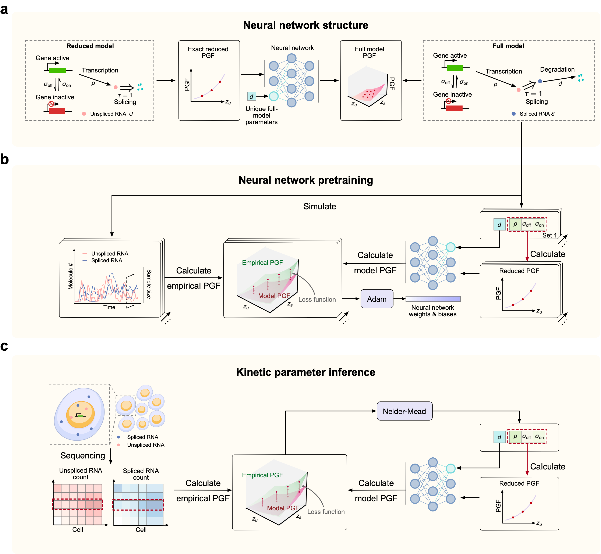

# Neural transfer of biophysical generating-function solutions enables robust integration of multinomial single-cell sequencing data


## Introduction

Multinomial single-cell sequencing data are often integrated with feature-concatenation strategies that can be effective empirically but do not explicitly preserve the biophysical structure of gene-expression dynamics. Here we present BRIDGE, a biophysically grounded neural framework that maps the known probability generating function (PGF) of an analytically tractable single-species gene-expression model to the unknown PGF of a larger multivariate model that contains it. This repository (**BRIDGE-analysis**) organizes the datasets and runnable codes used to reproduce the experiments and figures in the paper.

---

## Tutorials
The BRIDGE's neural network structure, pretraining protocol and inference protocol can be described as

A quick demo for applying BRIDGE to a delayed transcription-splicing model is in [example](Tutorials.ipynb).


## Repository Structure

1. **run BRIDGE/** contains all inference codes used in the manuscript.
   - **inference_BRIDGE2d.jl**: 
   - **inference_BRIDGE3d.jl**: 
   - **inference_BRIDGE_Feedback.jl**: 
   - **Inference_BRIDGE_Toggle.jl**: 
   - **Inference_BRIDGE_capture_rate.jl**:
   - **Inference_BRIDGE_ABC.jl**: 
   - **Inference_BRIDGE_Exact.jl**: 
   - **Inference_BRIDGE_FSP.jl**: 
   - **Inference_BRIDGE_MOM.jl**: 
   - **Inference_BRIDGE_NNCME.jl**: 
2. **train_BRIDGE/** contains codes and data for training the BRIDGE in the manuscript.
3. **parameters_trained/** contains trained weights and bias of BRIDGE in the manuscript.
4. **dataset/** contains trained weights and bias of BRIDGE in the manuscript.
---

## Corresponding package
The package can be installed through the Julia package manager:
```julia
using Pkg
Pkg.add(https://github.com/X-Y-Zhou/BRIDGE.jl)
using RNAInferenceTool
```


